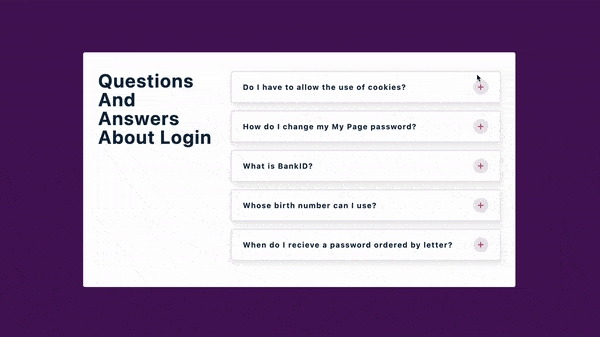

## Summary

- Toggle the info paragraph while clicking the plus or minus sign.

[Live Demo](https://christy313.github.io/react15-project04)



- idea: [uidesigndaily](https://uidesigndaily.com/posts/sketch-accordion-website-day-1175)

- [React Icons](https://react-icons.github.io/react-icons)

```
npm install react-icons --save
```

```javascript
import { FaHome } from 'react-icons/fa';
const Component = () => {
  return <FaHome className='icon'></FaHome>;
};
```

### note

There is a warning "Warning: React does not recognize the `pId` prop on a DOM element" if using ai from react-icons. Using bi instead of ai to solve this problem.

## File structure

```
.
├── README.md
├── package-lock.json
├── package.json
└── src
    ├── App.js
    ├── SingleQuestion.js
    ├── data.js
    ├── index.css
    └── index.js
```

## Available Scripts

In the project directory, you can run:

### `npm start`

Runs the app in the development mode.\
Open [http://localhost:3000](http://localhost:3000) to view it in your browser.
